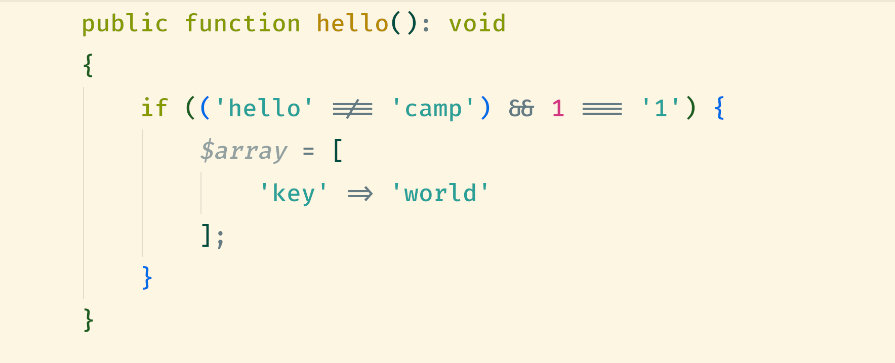
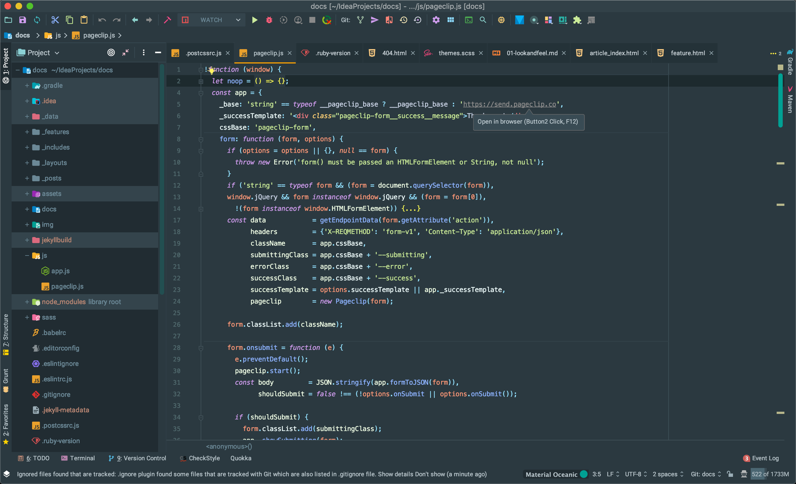
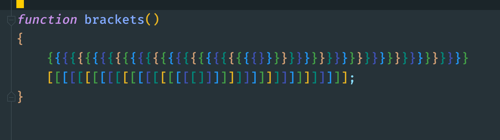
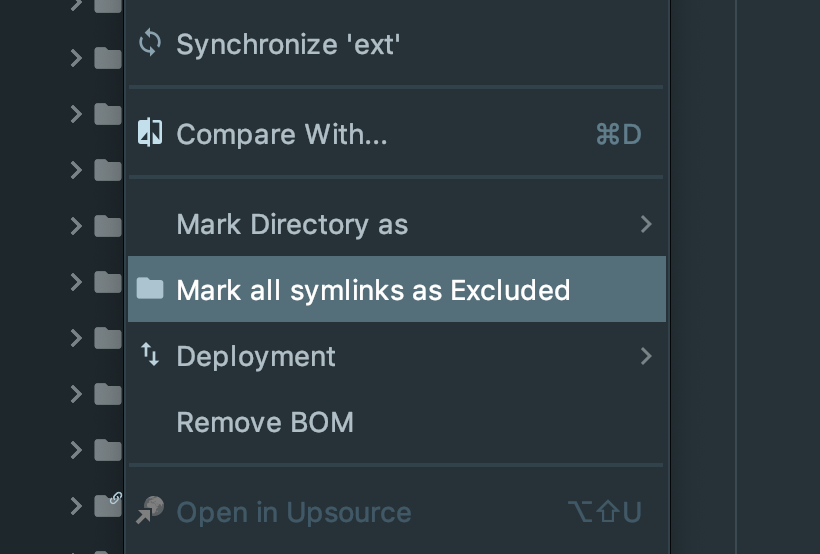
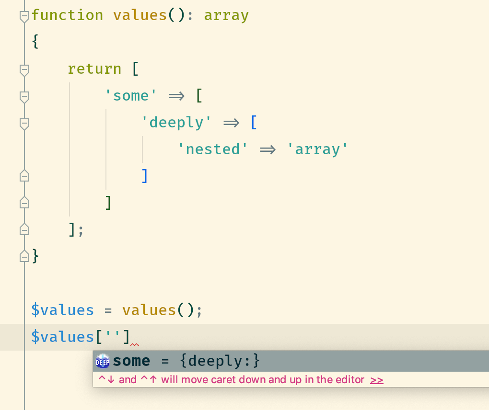
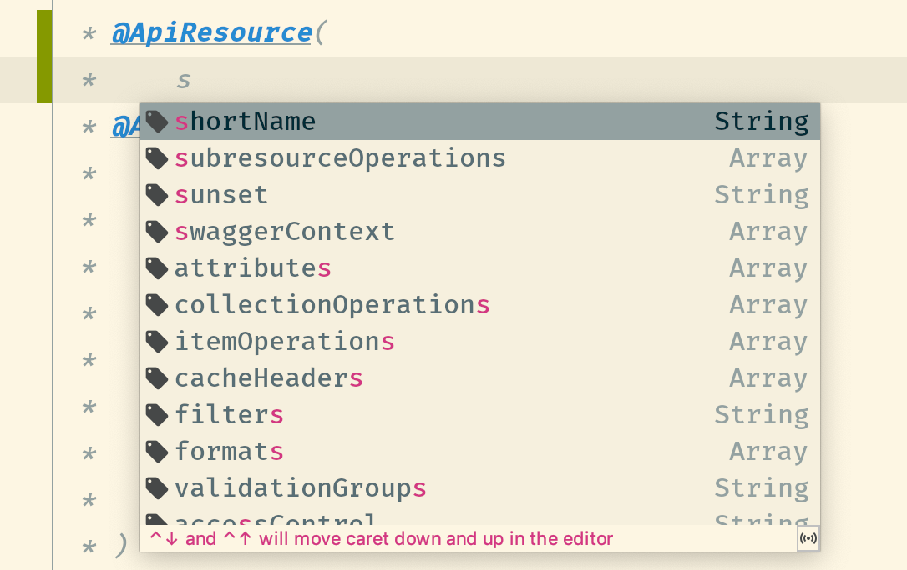
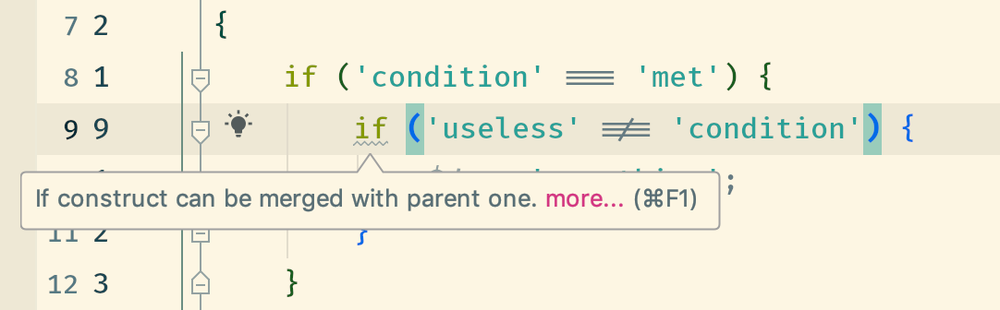

footer: © Wolfgang Klinger, plan2net GmbH 2019
slidenumbers: true

# PhpStorm 

## Style

---

# Fira font

https://github.com/tonsky/FiraCode

---

# Material Theme UI

Beautiful color schemes
Material design icons
Highly customizable

https://www.material-theme.com/

---

---

# Rainbow brackets

https://tinyurl.com/y78o5sqv

---

# PhpStorm 

## Plugins

---

# ideavim

Code faster
Use less mouse

https://github.com/JetBrains/ideavim/

---

# Exclude symlinks

https://tinyurl.com/y4zqowje

---

# deep-assoc-completion

https://tinyurl.com/yxpdb7mr

---

# PHP Annotations

https://tinyurl.com/yyo6le6y

---

# PHP Inspections (EA Extended)

Static code analysis

https://tinyurl.com/y62m889z

---

# Send me your suggestions

mailto:wk@plan2.net

https://github.com/plan2net/
https://github.com/wazum/

Thanks for listening
